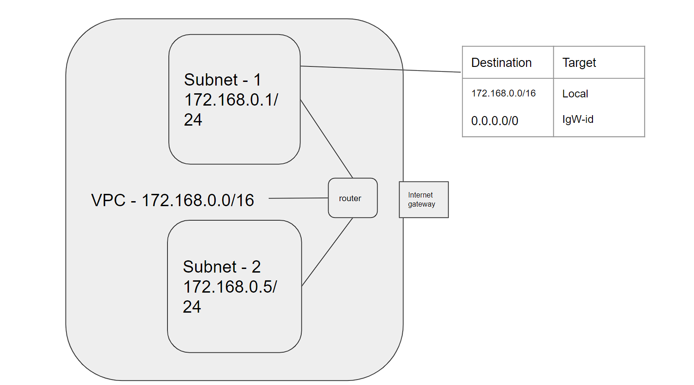

## HomeWork Class 10

    

  ### Procedure  
  
    Created vpc using the IP 172.168.0.0/16

    Created two subnet 172.168.0.1/24,172.168.0.5/24

    Added routing table for subnet one

    Added internet gateway

